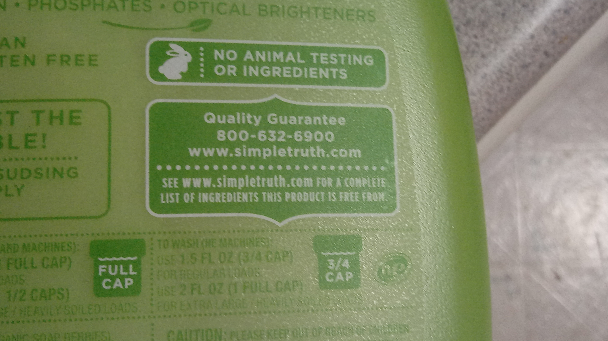

SEE OUR WEBSITE FOR A COMPLETE LIST OF INGREDIENTS THIS DETERGENT IS FREE FROM
==============================================================================

Acetylated ester of mono- and diglycerides

Sodium sulfite

Potassium bisulfate

Potassium metabisulfite

Potassium orthotrisulfite

Sulfites, both imaginary and real

Trans fatty acids

Cis, Hetero-normative fatty acids

Guar gum

Gwar

Antibiotics

Probiotics

Artificial colors (Synthetic and FD&C Certified)

Decertified team colors

Aspartame

Tame bears

Astaxanthin, acceptable in supplements, if natural

what?

Autolyzed yeast extract

awk

sed

grep

Bentonite (acceptable in supplements)

Supplement to the proceedings of the Council of Benton County

BHA (butylated hydroxyanisole)

anise

heh.

Brominated flour

Bleached flour

Bleached hair

Bleached bones of my defeated enemies

Red №5

Mambo №9

Brominated vegetable oil (BVO)

Bachman Turner Overdrive (BTO)

Calcium peroxide

Calcium sorbate

Tums©

Caprocaprylobehenin

Capybara

Nutria

*Opposum opposum*

Cochineal

Coachella

Burning Man

Burning sensation

Last week's sensation

Spilt milk

A pinch of salt

Cyclamates

Weevil

Weasel

Rat bastard got away with it

Chervil

Parsley, Sage, Rosemary

Timothy (ambiguous)

Dimethylpolysiloxane

Tears. Wait, René used to work in production; she says there are lots of tears.

Ennui. Definitely no ennui.

Dioctyl sodium sulfosuccinate

heh.

Ester gums

Esther Williams

Ethanol, ethyl alcohol, except that which is used as a natural flavor carrier.

ah, ha-ha-ha-ha-ha. No, really.

Ethyl vanillin

Vanilla Ice

Glycerol ester of wood rosin

Violin bows

Hexa-, hepta- and octa-esters of sucrose

Giga-mega-maxi-flop

High-fructose corn syrup

Modified food starch (acceptable if not chemically modified)

Shame (acceptable if not modified by self-deceit)

Neoteny

Axlotl

Oysters

Parabens

Brace-o'-Jakes

Partially hydrogenated oil

Sequentially decomposed functions

Scalar multiplication of matrices

The identity operation

Potassium sorbate (acceptable in supplements only)

20/20 vision (acceptible in hindsight)

A sense of propriety

Potassium nitrate or nitrite

Or whatever. I'm no chemist.

*Fortunella* spp.

Suicidal Kings

Carrots

Saccharin

Treacle

Simplesse

Noblesse oblige

Sodium aluminum phosphate

Solvent extracted oils, as stand-alone, single-ingredient oils (except grapeseed oil)

Way to be cagey, there.

An unknown strict sub-set of things in Heaven and Earth that have been dreamt of in Horatio's philosophy

More things than that

{ X | X ∉ { the set of things contained in this laundry detergent } }
