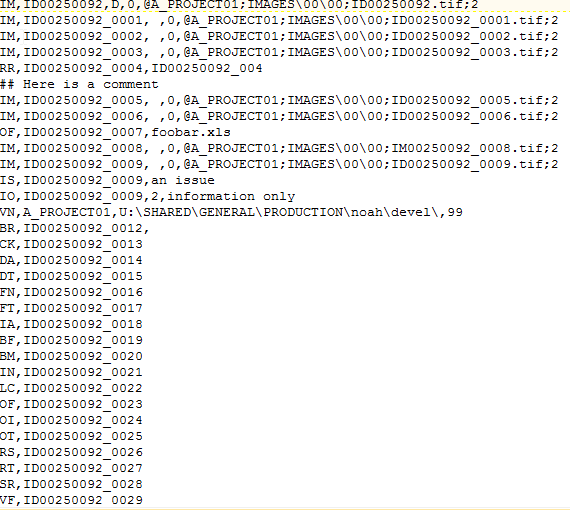
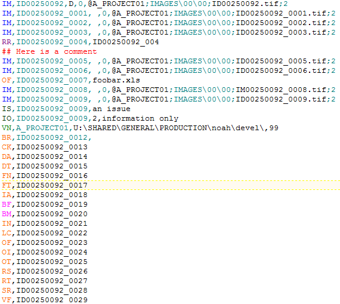

Syntax highlighting for lfp, opt, and dii files in Textpad.
<a href="./textpad-eed-syntax.zip">Here</a> is the installer.
Download it, unzip it, open the folder, and double click install.exe.
Sadly, this does not work for TextPad 5 or earlier.
Instructions for manual installation in TextPad 5 are in INSTALL.txt
The <a href="https://github.com/nbirnel/eed-syntax.git">source</a> is on github.
There are also vim syntax files there.

Screenshots:
Before:

After:

